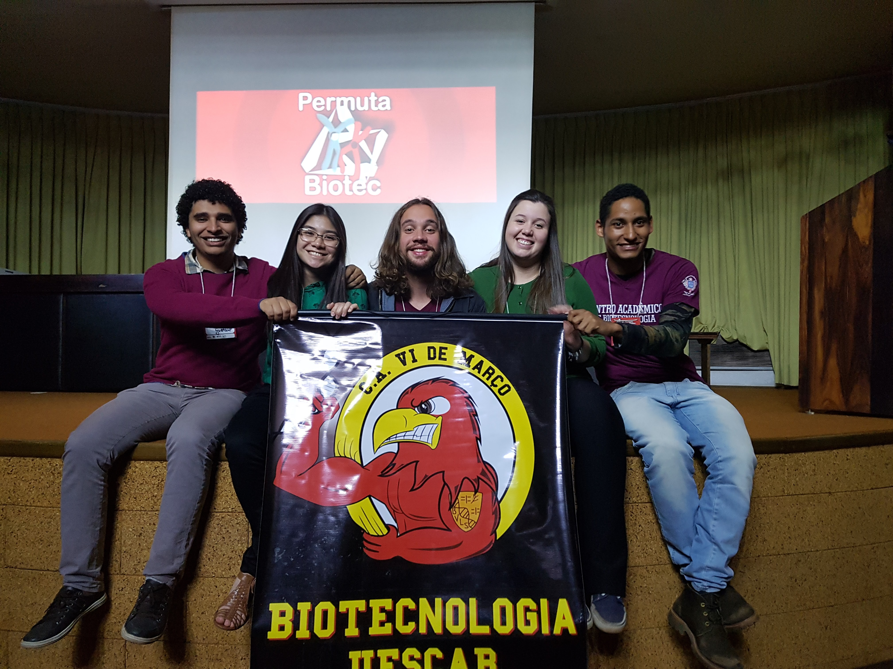
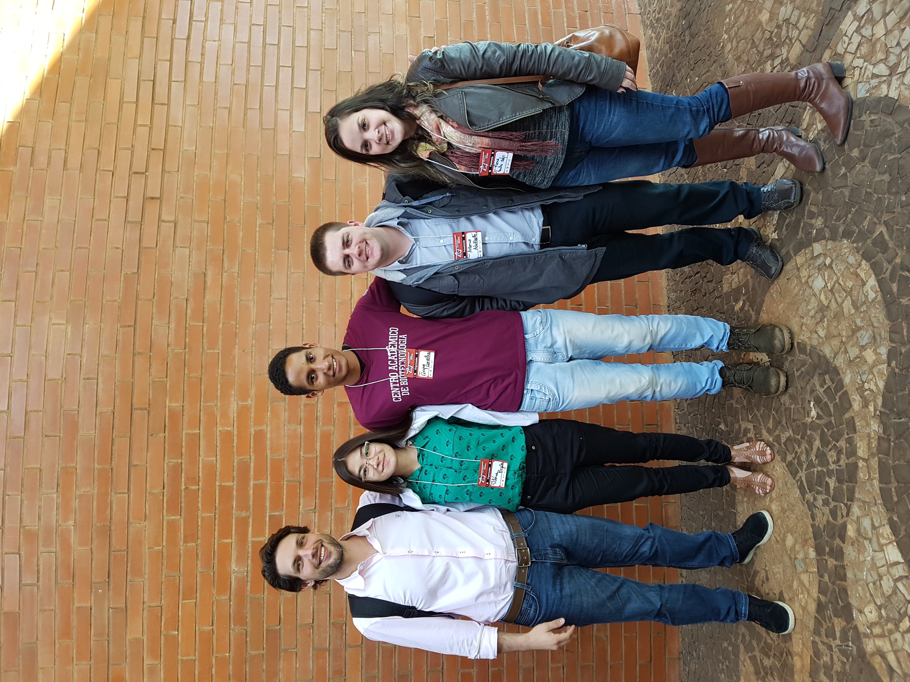
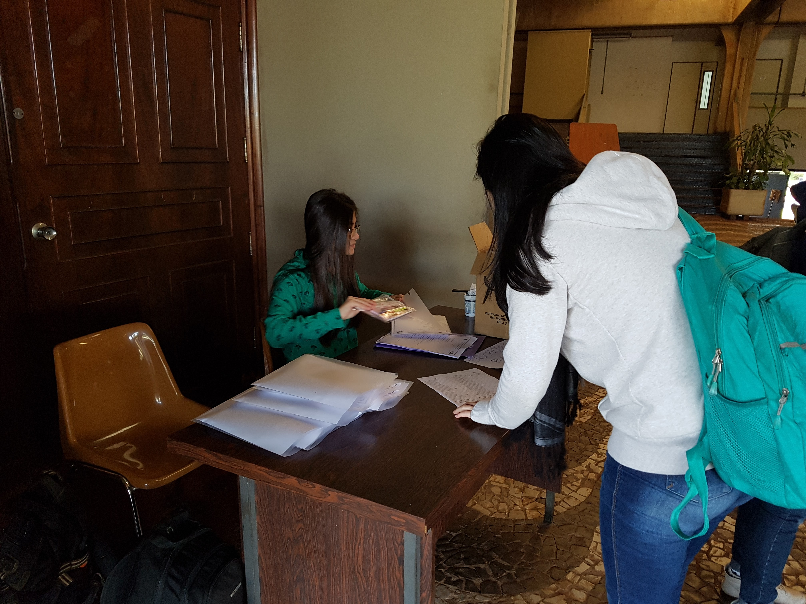

`Permuta Biotec` is a project whose objective is to provide students the opportunity to **meet** and **learn** from former students in the field of Biotechnology. Through this project, former students are invited to share their academic and professional experiences, **trajectories**, the challenges faced along the way, the achievements, and **lessons learned**.

It is a valuable opportunity for students to hear inspiring stories, gain insights into the field, clarify their doubts, and establish contacts, creating **networking** with former students who already have experience in the job market or academia. This exchange of information and contacts can open doors to future opportunities, such as trainee programs and jobs.

The Permuta Biotec project contributes to the academic and professional training of students by providing a broader view of a career in Biotechnology and allowing them to learn from the experience of other professionals. It is an initiative that strengthens the academic community and promotes the connection between different **generations** of students in the area.

| | | |
|:----------------------:|:----------------------:|:----------------------:|
|  Members of "Centro Acadêmico VI de março". Left to right Luiz Gustavo Ribeiro, Vitória Bizão Murakami, Pedro Jorge Ramos, Cláudia Reginato e Caique Carvalho | 
 Left to right Felipe Augusto Ferrari, Vitória Bizão, Caique Carvalho, Antonio Kaupert Neto, and Maria Paula Volpi|

 Event registration|
